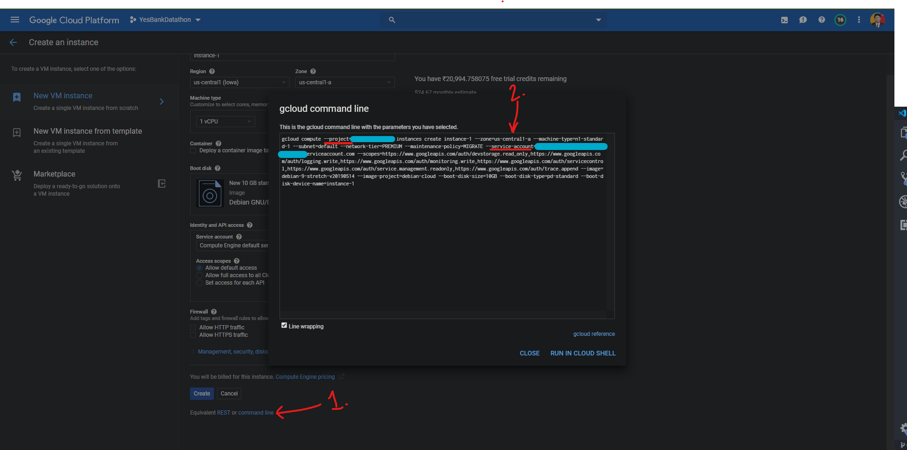

# GCP_Scripts
Contains scripts to do various tasks on GCP

### Make a Virtual Machine Instance and Make its IP static.

Updated 16 June 2019 : Steps to run:
1. Activate Google Cloud shell.
* First Time Use only(begin)
2. Create a blank file using `nano Create_VM.sh` or whatever name you prefer.
3. Copy the complete code from the given script to the created file.
4. Make changes to PROJECT and ACCOUNT fields. You can find the ACCOUNT by going to the command line option at the bottom of the page,
that you get while creating a new instance. It is shown in the picture.
5. Save and exit the script by pressing `CTRL + X`, then `Y` and at last press enter. This is for only nano editor.
6. Give executable permissions to the script using `chmod +x Create_VM.sh`.
7. For using the sql whitelisting feature, add your sql server instance name in the `SQL` field.
* First Time Use only(end)
7. Now you can run the script using `./Create_VM.sh <Name of Instance> <Any character such as 'white'>`

__IMPORTANT__
1. The OS ubuntu-1804-bionic-v20180522 has been changed to  ubuntu-1804-bionic-v20190612 since the former is not available.
2. Make sure you delete the static IP if you make another instance with the same name. If you don't, the new instance will have a different IP
which will not be made static.
3. Whitelisting is done on receiving a second argument(anything), which if not given, whitelisting is not done.
4. The authorized IP addresses are not able to get their name. To my knowledge, their is no option available to set this field using CLI, although it could be done using the GUI Console.
